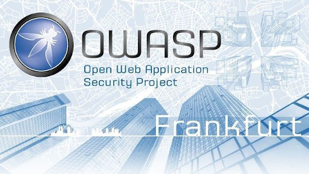

---

layout: col-sidebar
title: OWASP Germany > Stammtische > Frankfurt

---

## Introduction

Welcome to OWASP Frankfurt Stammtisch, regional Stammtisch within the [OWASP Germany Chapter](https://owasp.org/www-chapter-germany/) with a focus on Rhine-Main area to discuss and share topics around IT and application security. 

Anyone with an interested and enthusiastic about IT and application security is welcome. All meetings are free and open. You do not have to be an OWASP member. 

Referrals to this website or to individual meetings to colleagues or acquaintances are welcome.

## Upcoming Events 



Hi everybody, we're looking forward for virtually meeting you again for our #50th OWASP Meetup!

## What's going to happen?
To be announced - usually exciting talks around offensive security, blue teaming or application security!

## When?
Announced via our [OWASP Frankfurt Stammtisch Meetup Group](https://www.meetup.com/IT-Security-Stammtisch-Frankfurt-OWASP-u-w/).

## Where?
GoTo Meeting or Zoom - access details to be announced via Meetup!

## Further Notes
Please join our [OWASP Frankfurt Stammtisch Meetup Group](https://www.meetup.com/IT-Security-Stammtisch-Frankfurt-OWASP-u-w/) and follow us on [Twitter](https://twitter.com/owasp_frankfurt) for timely updates on our OWASP Stammtisch Frankfurt Meetup.

Anyone with an interest in our topics is welcome. All meetings are free and open. You do not have to be an OWASP member to attend. Referrals to this website or to individual meetings to colleagues or acquaintances are welcome.

## Information about Frankfurt Stammtisch Events

### When?
We will be running a Meetup every 2-3 months with the option to have additional Meetups for hands-on workshops.  

### Where?
For the reminder of 2021, we will be running virtual. If you would like to host our Meetup in-person (event venue suitable for +50 people), please reach out to us.

Upcoming events are aßnnounced on Meetup: [Meetup](http://www.meetup.com/de/IT-Security-Stammtisch-Frankfurt-OWASP-u-w/) and [Twitter](https://twitter.com/owasp_frankfurt). 

### What?
We usually have one or two talks about a related topic to information security with the option of a hands-on workshop in parallel.

## Organization

### Call for Speakers and Volunteers

**We are looking for presentations for the next virtual Stammtische in 2021!** If you'd like to give a presentation, conduct a training workshop or volunteer for us, contact us the OWASP Frankfurt Stammtisch organisation.

### Etiquette
Please note that vendor pitches are not allowed, so please adhere to the [OWASP Speaker Agreement](https://owasp.org/www-policy/legal/speaker-agreement) and avoid marketing stunts.

## Previous Events

An overview of our past Frankfurt Stammtisch events from 2011 to 2021.

## 2021
### **51. [OWASP Stammtisch Frankfurt](https://www.meetup.com/IT-Security-Stammtisch-Frankfurt-OWASP-u-w/events/280950081/) (Virtual) | 27.10.2021, 19:00h**
* Keynote: **Christian Schneider - Agile Threat Modeling using Open Source Tools** [KEYNOTE SLIDES](assets/slides/51_OWASP_Frankfurt_Stammtisch_1.pdf)
* Talk: **Johannes Schönborn - Counterintelligence in Red Teaming using MITRE ENGAGE** | [TALK SLIDES](assets/slides/51_OWASP_Frankfurt_Stammtisch_2.pdf)
* Talk: **Aaron Rinehart - A Primer on Security Chaos Engineering by Aaron Rinehart** | [TALK SLIDES]()
* Recording (Full): [YOUTUBE]()
* Location: Virtual - OWASP Zoom

### **50. [OWASP Stammtisch Frankfurt](https://www.meetup.com/IT-Security-Stammtisch-Frankfurt-OWASP-u-w/events/280033268/) (Virtual) | 25.08.2021, 18:30h**
* Keynote: **Felix Kosterhon - Vulnerability Research of Linux Audit Framework (auditd) and CVE-2020-35501** [KEYNOTE SLIDES](assets/slides/50_OWASP_Frankfurt_Stammtisch_1.pdf)
* Talk: **Matthias Altmann - Malicious Code Injection via DOM Clobbering Technique** | [TALK SLIDES](assets/slides/50_OWASP_Frankfurt_Stammtisch_2.pdf)
* Talk: **Calvin Hansch - Comparing Windows Host Auditing Tools for Pentests by Calvin Hansch** | [TALK SLIDES](assets/slides/50_OWASP_Frankfurt_Stammtisch_3.pdf)
* Recording (Full): [YOUTUBE](https://www.youtube.com/channel/UCcSCpYuuGeEIn70KQCF-4gQ)
* Location: Virtual - OWASP Zoom

### **49. [OWASP Stammtisch Frankfurt](https://www.meetup.com/IT-Security-Stammtisch-Frankfurt-OWASP-u-w/events/277885046/) (Virtual) | 28.07.2021, 18:30h**
* Keynote: **Rory McCune - Container Orchestration Security**
* Keynote Recording (Part 1): [YOUTUBE](https://youtu.be/DNmd_2vxVo0)
* Talk: **Kyle Cucci - Malware Analysis to Drive Threat Hunting & Detection Engineerin.** [TALK SLIDES](assets/slides/49_OWASP_Frankfurt_Stammtisch_2.pdf)
* Talk Recording (Part 2): [YOUTUBE](https://youtu.be/a3ETHloJDGo)
* Location: Virtual - OWASP Zoom

### **48. OWASP Stammtisch Frankfurt (Virtual) | 28.04.2021, 18:00h**
* Keynote: **Timo Pagel - Overview of OWASP (DevSecOps) project** | [KEYNOTE SLIDES](assets/slides/48_OWASP_Frankfurt_Stammtisch_1.pdf)
* Workshop: **Daniel Gora - Hands-On Introduction to OWASP Juice Shop**
* Lightnig Talk: **Mihael Stanojevic - Physical Red Teaming** | [LIGHNTING TALK SLIDES](assets/slides/48_OWASP_Frankfurt_Stammtisch_2.pdf)
* Recording: [YOUTUBE](https://youtu.be/8webiYnF56A)
* Location: Virtual - OWASP Zoom

### **47. OWASP Stammtisch Frankfurt (Virtual) | 24.02.2021, 18:00h**
* Keynote: **Kevin Ott - Emulating Supply Chain Attacks with Open Source Tools**
* Talk: **Marius Klimmek - My Journey from Red to Purple Teaming**
* Slides: [PRESENTATION DECK](assets/slides/47_OWASP_Frankfurt_Stammtisch_2.pdf)
* Workshop: with Artur Stöber - Hands-On Hacking with VulnHub
* Recording: [YOUTUBE](https://www.youtube.com/watch?v=Jk0-X6CK4Ys)
* Location: Virtual - GoToMeeting

## 2019
### **46. OWASP Stammtisch Frankfurt | 23.10.2019**
* Talk: **Reversing a Cobalt Strike Beacon**
* Location: Capri by Fraser (Europa-Allee 42, Frankfurt)

### **45. OWASP Stammtisch Frankfurt | 14.08.2019**
* Talk: **Let's hack! - An intro to Cobalt Strike**
* Location: Capri by Fraser (Europa-Allee 42, Frankfurt)

### **44. OWASP Stammtisch Frankfurt | 27.02.2019, 19:30h**
* Talk: **My favourite BBQ: Kerberoasting**
* Slides: [PRESENTATION DECK](assets/slides/44_OWASP_Frankfurt_Stammtisch.pdf)
* Recording: [YOUTUBE](https://www.youtube.com/watch?v=WoqXAi5iHF4)
* Location: Exploit Labs will host us as Hotel Capri by Fraser (Europa-Allee 42, Frankfurt)

## 2018

### **43. OWASP Stammtisch Frankfurt | 07.11.2018, 19:30h**
* Keynote: **Jim Manico - Introduction to OWASP and Application Security Verification Standard 4.0**
* Slides: [PRESENTATION DECK](assets/slides/43_OWASP_Frankfurt_Stammtisch_1.pdf)
* Talk: **Daniel Gora - Gamification of Application Security with OWASP Cornucopia**
* Slides: [PRESENTATION DECK](assets/slides/43_OWASP_Frankfurt_Stammtisch_2.pdf)
* Talk: Cedric Klosa - My Ethical Hacking Success Story with
HackTheBox.eu
* Location: Exploit Labs will host us as Hotel Capri by Fraser (Europa-Allee 42, Frankfurt)

### **42. OWASP Stammtisch Frankfurt | 05.09.2018, 19:30h**
* Talk: **Johannes Schönborn - Getting Started with Ethical Hacking w/a Mentor**
* Slides: [PRESENTATION DECK](assets/slides/42_OWASP_Frankfurt_Stammtisch.pdf)
* Location: Blue Frost Security will once more host us at Hotel Capri

### **41. OWASP Stammtisch Frankfurt | 30.05.2018, 19:30h**
* Talk: **Michael Ritter - Active Directory Hacking**
* Slides: [PRESENTATION DECK](assets/slides/41_OWASP_Frankfurt_Stammtisch.pdf)
* Location: Blue Frost Security will once more host us at Hotel Capri

### **40. OWASP Stammtisch Frankfurt | 28.03.2018, 19:30h**
* Talk: **Kevin Ott - GoLang for Pentesting/Red Teaming**
* Slides: [PRESENTATION DECK](assets/slides/40_OWASP_Frankfurt_Stammtisch.pdf)
* Location: Blue Frost Security will once more host us at Hotel Capri

### **39. OWASP Stammtisch Frankfurt | 30.01.2018, 19:30h**
* Talk: **Sebastian Haas - Fun with Bashbunny**
* Slides: [PRESENTATION DECK](assets/slides/39_OWASP_Frankfurt_Stammtisch.pdf)
* Location: Blue Frost Security will once more host us at Hotel Capri

## 2017

### **38. OWASP Stammtisch Frankfurt | 29.11.2017, 19:30h**
* Talk: **Johannes Schönborn - Pentest vs. Red Team**
* Location: Blue Frost Security will once more host us at Hotel Capri!

### **37. OWASP Stammtisch Frankfurt | 20.9.2017, 19:30h**

* Talk: **Johannes Schönborn - Introduction to OWASP**
* Slides: [PRESENTATION DECK](assets/slides/37_OWASP_Frankfurt_Stammtisch.pdf)
* Location: Blue Frost Security will once more host us at Hotel Capri!

### **36. OWASP Stammtisch Frankfurt | 26.7.2017, 19:30h**

* Talk: **Christoph - A closer look at Bionic - a software quality assessment and security analysis of Android's foundation**
* Slides: [PRESENTATION DECK](assets/slides/36_OWASP_Frankfurt_Stammtisch.pdf)
* Location: Blue Frost Security will once more host us at Hotel Capri!

### **35. OWASP Stammtisch Frankfurt | 31.5.2017, 19:30h**

* Talk: **Privilege Escalation with strace and PowerShell**
* Location: Blue Frost Security will once more host us at Hotel Capri!

### **34. OWASP Stammtisch Frankfurt | 29.3.2017, 19:30h**

* Talk: **Hack of Disconnected Object", "Look Mom, I don't use Shellcode!**
* Location: Blue Frost Security will once more host us at Hotel Capri!

### **33. OWASP Stammtisch Frankfurt | 25.01.2017, 19:30h** 
* Talk: **Per Thorsheim on Passwords**
* Location: Blue Frost Security will once more host us at Hotel Capri!

## 2016

### **32. OWASP Stammtisch Frankfurt | 24.11.2016, 19:30h** 
* Talk: **Mobile Application Pentesting mit ein paar Anekdoten**
* Location: Exploit Labs, Friedrich-Ebert-Anlage 36, Frankfurt am Main

### **31. OWASP Stammtisch Frankfurt | 27.10.2016, 19:30h**
* Talk: **Eine Einführung: Angriffserkennung mit SIEM (Kathi)**
* Location: Exploit Labs, Friedrich-Ebert-Anlage 36, Frankfurt am Main

### **30. OWASP Stammtisch Frankfurt | 29.09.2016, 19:30h**
* Talk: **Community Live Hacking "your fav. challenge"**
* Location: DZ BANK AG, Mainzer Landstraße 58, 60325 Frankfurt am Main

### **29. OWASP Stammtisch Frankfurt | 30.06.2016, 19:30h**
* Talk: **Google-Hacking mit Florian Ammon**
* Location: DZ BANK AG, Mainzer Landstraße 58, 60325 Frankfurt am Main

### **28. OWASP Stammtisch Frankfurt | 30.06.2016, 19:30h** 
* Talk: **Community Live Hacking OWASP Juiceshop**
* Location: DZ BANK AG, Mainzer Landstraße 58, 60325 Frankfurt am Main

### **27. OWASP Stammtisch Frankfurt | 19.05.2016, 19:30h** 
* Talk: **Olaf Bormann - Anforderungen an das Application Security Management - Von der Anforderung bis zur Außerbetriebnahme**
* Location: DZ BANK AG, Mainzer Landstraße 58, 60325 Frankfurt am Main

### **26. OWASP Stammtisch Frankfurt | 28.04.2016, 19:30h**
* Talk: **Christian - DevOps & CI**
* Location: DZ BANK AG, Mainzer Landstraße 58, 60325 Frankfurt am Main

### **25. OWASP Stammtisch Frankfurt | 31.03.2016, 19:30h** 
* Talk: **Johannes Schönborn, Manuel Giesel - 1x1 Threat Intelligence**
* Location: DZ BANK AG, Mainzer Landstraße 58, 60325 Frankfurt am Main

### **24. OWASP Stammtisch Frankfurt | 25.02.2016, 19:30h**
* Talk: **Boban Krsic - IT-Sicherheitsgesetz - und nun?"**
* Slides: [PRESENTATION DECK](assets/slides/24_OWASP_Frankfurt_Stammtisch.pdf)
* Location: Tower 185, Friedrich-Ebert-Anlage 35-37, 60327 Frankfurt am Main

## 2015

### **23. OWASP Stammtisch Frankfurt | 28.01.2015, 19:30h**
* Talk: **Christoph - Social Engineering**
* Slides: [PRESENTATION DECK](assets/slides/23_OWASP_Frankfurt_Stammtisch.pdf)
* Location: Tower 185, Friedrich-Ebert-Anlage 35-37, 60327 Frankfurt am
Main

### **22. OWASP Stammtisch Frankfurt | 26.11.2015, 19:30h**
* Talk: **Johannes Schönborn - "Faraday: Pentesting goes Multiplayer"**
* Location: Tower 185, Friedrich-Ebert-Anlage 35-37, 60327 Frankfurt am
Main

### **21. OWASP Stammtisch Frankfurt | 29.10.2015, 19:30h**
* Talk: **Khalil Bijjou - Web Application Firewall Bypassing - how to defeat the blue team** 
* Slides: [PRESENTATION DECK](assets/slides/21_OWASP_Frankfurt_Stammtisch.pdf)
* Location: Tower 185, Friedrich-Ebert-Anlage 35-37, 60327 Frankfurt am Main

### **20. OWASP Stammtisch Frankfurt | 24.09.2015, 19:30h** 
* Talk: **Jan Philipp - "Security Challenges of Cloud Providers" -  "Wie baue ich sichere Luftschlösser in den Wolken”)**
* Slides: [PRESENTATION DECK](assets/slides/20_OWASP_Frankfurt_Stammtisch.pdf)
* Location: Franklinstraße 50, 60486 Frankfurt am Main

### **19. OWASP Stammtisch Frankfurt | 27.08.2015, 19:30h** 
* Talk: **Manuel Giesel und Johannes Schönborn - "Lust und Frust bei der Netzwerk-Anomalieerkennung**
* Location: Tower 185, Friedrich-Ebert-Anlage 35-37, 60327 Frankfurt am Main

### **18. OWASP Stammtisch Frankfurt | 30.07.2015, 19:30h**
* Talk: **Katharine Brylski - Ein Best-of-Konzept für Sicherheitsanalysen von Webanwendungen**
* Slides: [PRESENTATION DECK](assets/slides/18_OWASP_Frankfurt_Stammtisch.pdf)
* Location: Tower 185, Friedrich-Ebert-Anlage 35-37, 60327 Frankfurt am Main

### **17. OWASP Stammtisch Frankfurt | 25.06.2015, 19:30h**
* Talk: **Alexios Fakos - (Un)Sicherheit bei ihrer Applikation? Präventiv statt reaktiv**
* Slides: [PRESENTATION DECK](assets/slides/17_OWASP_Frankfurt_Stammtisch.pdf)
* Location: Tower 185, Friedrich-Ebert-Anlage 35-37, 60327 Frankfurt am Main

### **16. OWASP Stammtisch Frankfurt | 28.05.2015, 19:30h**
* Talk: **Marius Klimmek - Sowas wie Botnetze – Die dunkle Gefahr der Zombie Armee**
* Slides: [PRESENTATION DECK](assets/slides/16_OWASP_Frankfurt_Stammtisch.pdf)
* Location: Tower 185, Friedrich-Ebert-Anlage 35-37, 60327 Frankfurt am Main

### **15. OWASP Stammtisch Frankfurt | 30.04.2015, 19:30h** 
* Talk: **Daniel Zelle - Einführung und Überblick - Von Car2X- bis In-Vehicel-Security**
* Slides: [PRESENTATION DECK](assets/slides/15_OWASP_Frankfurt_Stammtisch.pdf)
* Location: Tower 185, Friedrich-Ebert-Anlage 35-37, 60327 Frankfurt am
Main

### **14. OWASP Stammtisch Frankfurt | 26.03.2015, 19:30h**
* Talk: **Michael Ritter - Web Application Firewall Profiling**
* Slides: [PRESENTATION DECK](assets/slides/14_OWASP_Frankfurt_Stammtisch.pdf)
* Location: Franklinstraße 50, 60486 Frankfurt am Main

### **13. OWASP Stammtisch Frankfurt | 26.02.2015, 19:30h** 
* Talk: **Alexios Fakos - Polyglotte Angriffsvektoren**
* Location: Tower 185, Friedrich-Ebert-Anlage 35-37, 60327 Frankfurt am
Main

### **12. OWASP Stammtisch Frankfurt | 29.01.2015, 19:30h**
* Talk: **Jan Philipp - SharePoint Sicherheit im 'schlüpfrigen' Griff**
* Slides: [PRESENTATION DECK](assets/slides/12_OWASP_Frankfurt_Stammtisch.pdf)
* Location: Franklinstraße 50, 60486 Frankfurt am Main

## 2014

### **11. OWASP Stammtisch Frankfurt | 27.11.2014, 19:30h**
* Talk: **Johannes Schönborn - APT – the Good, the Bad and the Ugly**
* Location: Tower 185, Friedrich-Ebert-Anlage 35-37, 60327 Frankfurt am Main

### **10. OWASP Stammtisch Frankfurt | 30.10.2014, 19:30h**
* Talk: **Alexander Klink - Denial of Service auf Applikationsebene**
* Note: _Stammtisch Frankfurt feierte sein Comeback!_
* Slides: [PRESENTATION DECK](assets/slides/10_OWASP_Frankfurt_Stammtisch.pdf)
* Location: Tower 185, Friedrich-Ebert-Anlage 35-37, 60327 Frankfurt am Main

## 2013

### **3. Rhein-Main-OWASP-Stammtisch | 27.11.2013 at 19:00**
* Note: Stammtisch took place in the wine bar [Wangenrot](http://www.vinothek-wangenrot.de/weinbar-vinothek-mainz.html) at Stephansplatz 1 in Mainz

### **2. Rhein-Main-OWASP-Stammtisch  | 26.09.2013 at 19:00h**
* Note: The second Rhein Main Stammtisch took place at 19:00 in Frankfurt in [Vita Vera](http://www.ristorante-vitavera.de/1.html).

### **1. Rhein-Main-OWASP-Stammtisch The Frankfurt OWASP Stammtisch, 25.06.2013 at 19:00h**
* Note: renamed in Rhein Main Stammtisch and took place on  in
Frankfurt.

## 2012

### **6. OWASP Stammtisch Frankfurt | 21.11.2012 at 19:00**
* Note: The topic of the Stammtisch was the review of the German OWASP Day 2012 and took place in the [Vita Vera](http://www.ristorante-vitavera.de/1.html)

### **5. OWASP Stammtisch Frankfurt The 5th Frankfurt OWASP**
* Note: Stammtisch took place on 26.09.2012, 18:30 in the [Vita Vera](http://www.ristorante-vitavera.de/1.html). The topic was the exchange about security topics as well as common networking.

## 2011

### **4. OWASP Stammtisch Frankfurt The 4th Frankfurt OWASP**
* Note: The fourth OWASP Frankfurt Stammtisch took place on 23.11.2011 at [Depot 1899](http://www.depot1899.de/). Bars were tested in which one can hold perhaps also a lecture with following discussion.

### **3. OWASP Stammtisch Frankfurt The 3rd Frankfurt OWASP**
* Note: The third OWASP Stammtisch Frankfurt took place on 21.09.2011 in the [Arche Nova, Kasseler Str. 1a, Frankfurt a.M.](http://j.mp/piQdaP).
