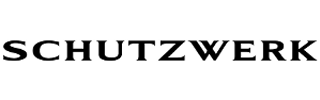
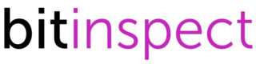
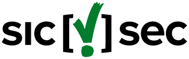
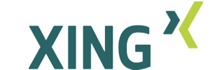
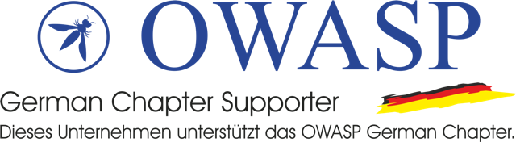
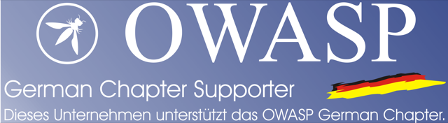

## Sponsoren des German OWASP Chapters 

---

---

---

---

---

## Germany/Chaptersponsor

OWASP ist ein gemeinnütziger Verein (in Europa mit Sitz in Belgien), der
viele Projekte, Dokumente und Tools auf die Beine gestellt hat und so
die Mission "Websicherheit" folgt. Fast aller diese sichtbaren
Ergebnisse beruhen auf viel ehrenamtlicher Arbeit.

Ein Verein wie OWASP hat jedoch auch Unkosten, um Projekte, Dokumente
und Tools zu fördern und weiter auf dem aktuellen Stand zu halten.
Unsere Infrastruktur wie Server, Accounting und unsere Administration
wollen auch bezahlt sein.

OWASP finanziert die Projekte und seine Organisation durch Sponsoren
sowie Eintrittserlöse aus Veranstaltungen. Ein Sponsor unterstützt die
Arbeit von OWASP nachhaltig. Für Firmen gibt es in Deutschland ein
spezielles Angebot.

### Unser Angebot

Für einen Jahresbeitrag von EUR 500,00 netto erhalten Sie:

- Firmenbanner (PNG oder SVG, 320x100px) inkl. Link zu Ihrer Homepage
  auf
  [www.owasp.org/index.php/Germany](https://www.owasp.org/index.php/Germany)
  (auch erreichbar über
  [www.owasp.de](https://www.owasp.de/))
- Berechtigung, sich „OWASP Germany Chapter Supporter“ in Texten zu
  nennen und das Supporter Banner auf Ihrer Webseite zu platzieren
- Ein Konferenzteilnehmer (inkl. Networking-Abend) Ihres Unternehmens
  oder aus Ihrem Kundenkreis an der bislang jährlich stattfindenden
  Konferenz des OWASP German Chapter

### Interesse

Schreiben Sie bitte an unseren Verantwortlichen für alle
Sponsoringfragen
[Alexios Fakos](mailto:alexios.fakos@owasp.org). Wir freuen uns auf Ihre
Nachricht.

### Supporter Banner

Das Supporter Banner gibt es in zwei Varianten, in Farbe und
transparent.

#### Transparent

---

#### Farbe

---

